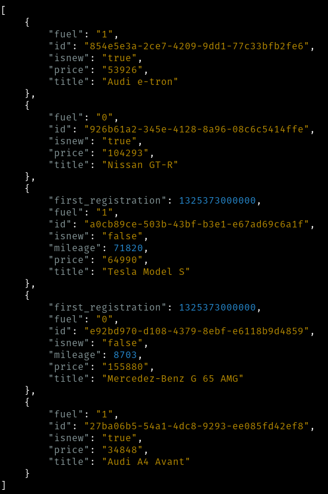

# AUTOSCOUT24 Technical Exercise

## Task Description

Car adverts should have the following fields:
* **id** (_required_): **int** or **guid**, choose whatever is more convenient for you;
* **title** (_required_): **string**, e.g. _"Audi A4 Avant"_;
* **fuel** (_required_): gasoline or diesel, use some type which could be extended in the future by adding additional fuel types;
* **price** (_required_): **integer**;
* **new** (_required_): **boolean**, indicates if car is new or used;
* **mileage** (_only for used cars_): **integer**;
* **first registration** (_only for used cars_): **date** without time.

Service should:
* have functionality to return list of all car adverts;
  * optional sorting by any field specified by query parameter, default sorting - by **id**;
* have functionality to return data for single car advert by id;
* have functionality to add car advert;
* have functionality to modify car advert by id;
* have functionality to delete car advert by id;
* have validation (see required fields and fields only for used cars);
* accept and return data in JSON format, use standard JSON date format for the **first registration** field.

## Solution Description
This solution is backboned by Scala Play REST API example. Some key features regarding the solution is described as follows,

### Solved
1. Local storage is a mock DB class `CarRespository` with a `CarResourceHandler` for data I/O, with 5 car examples listed

    - shortage: 
        - data in RAM not in disk
        - didn't practice Amazon Dynamo DB or any other kinds.
    - improvements: 
        - data storage using ListBuffer, some other data structure like heap or tree like can be considered.
2. Data fields: mostly using primitive types, with Date using java.utils.Date.
3. APIs are implemented following MVC structure, where `CarController` describes all of the features
    - validation: using play **Form** with verifying to check the used car dependencies.
    - improvements:
        - For modify API, how to correctly use option which also impose constraint to other field?
        - **modify**: use var for case class(not suggested for case class to be mutable), a better way?

4. CORS request handling directly using cors filter from play. More customized way could be studied.
 

### Total Time Spent
- Thursday [1700 - 1800] : Studied Scala, play, and review web fundamntals.
- Friday [1300 - 1700] & Saturday [1300 - 1600] : Implementing.
- Sunday [1200 - 1300] : Did a bit more on CORS and decided to hand in.
- Total: 9 hrs

### Future work
1. test
2. Amazon Dynamo DB


## Installation & Running

### Requirements
- java higher than 8
- sbt

### Installation

Install the projects.

```bash
git clone https://github.com/dnychennnn/AutoScout24_exercise.git
cd AutoScout24_exercise/
```

You need to download and install sbt for this application to run.

Once you have sbt installed, the following at the command prompt will start up Play in development mode:

```bash
sbt run
```

Play will start up on the HTTP port at <http://localhost:9000/>.   You don't need to deploy or reload anything -- changing any source code while the server is running will automatically recompile and hot-reload the application on the next HTTP request.

## Usage

If you call the same URL from the command line, you’ll see JSON. Using [httpie](https://httpie.org/), we can execute the command:


**LIST** : To list all cars (defaul sorted by id)
```bash
http --verbose http://localhost:9000/v1/cars
```
and get back:

```routes
GET /v1/cars HTTP/1.1
```

**LIST with query** : To list cars with optional sorting by field, e.g. price
```bash
http --verbose http://localhost:9000/v1/cars/?sort_by=price
```
and get back(example):

```routes
GET /v1/cars/?sort_by=price HTTP/1.1 
```

**GET single car advert**: To return a single car advert using GET request
```bash
http --verbose http://localhost:9000/v1/cars/id
```

**ADD car advert** : To add car advert with POST request
```bash
http --verbose POST http://localhost:9000/v1/cars title="abc" fuel=0 price=12341234 isnew=true
```

**DELETE car advert** : To delete car advert by **id** with DELETE request, e.g., delete "Audi e-tron"(uuid = 77144954-beff-410b-9dff-a39e259a2ac0)
```bash
http --verbose DELETE http://localhost:9000/v1/cars/"77144954-beff-410b-9dff-a39e259a2ac0"
```

**MODIFY car advert** : Modify car advert through **id** with PUT request,
```bash
http --verbose PUT http://localhost:9000/v1/cars/$id title="Porsche Cayann"
```
